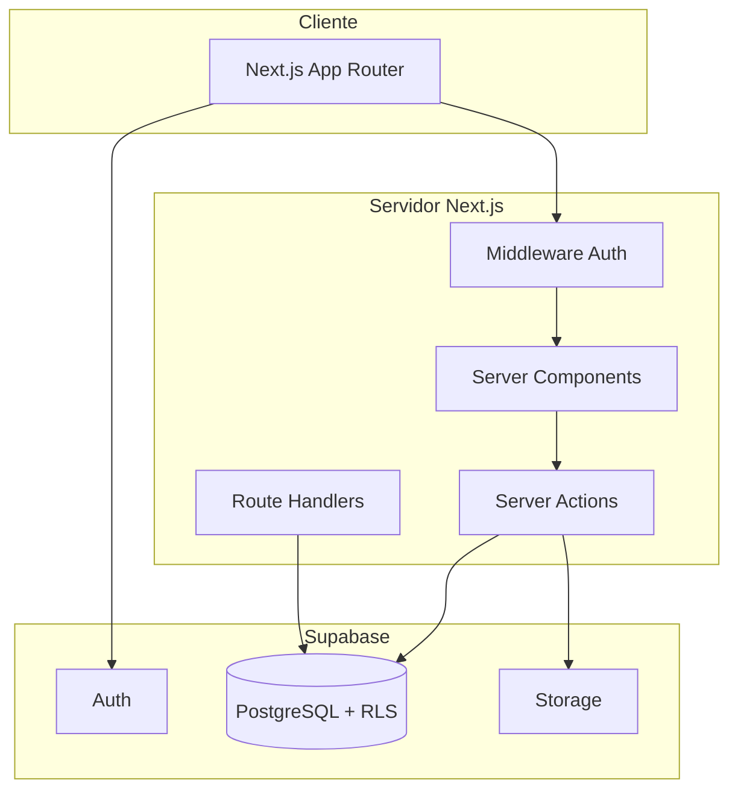

# Arquitetura — Plataforma Bússola

## Visão geral

Monólito modular implantado na Vercel, com PostgreSQL/Supabase como fonte única de verdade.

## Módulos

| Módulo | Responsabilidade |
|--------|------------------|
| `core/auth` | Sessão, contexto de tenant |
| `core/audit` | Eventos de auditoria |
| `core/permissions` | RBAC (via banco) |
| `learning/domain` | Regras de progresso e conclusão |
| `learning/actions` | Mutações server-side |
| `learning/queries` | Leituras agregadas |

## Multi-tenancy

- `tenant_id` em todas as tabelas privadas
- Conteúdo global: `tenant_id IS NULL` + `is_global = true`
- Organização ativa em `user_organization_context`
- Isolamento garantido por RLS, não apenas filtros no frontend

## Integrações futuras

Eventos de domínio em `domain_events` com campos genéricos:
- `source_module`, `source_entity_type`, `source_entity_id`
- Links contextuais em `learning_action_links`

## Feature flags

Funcionalidades de fases posteriores controladas por `feature_flags`:
- Avaliações, certificados, gamificação, aulas ao vivo
