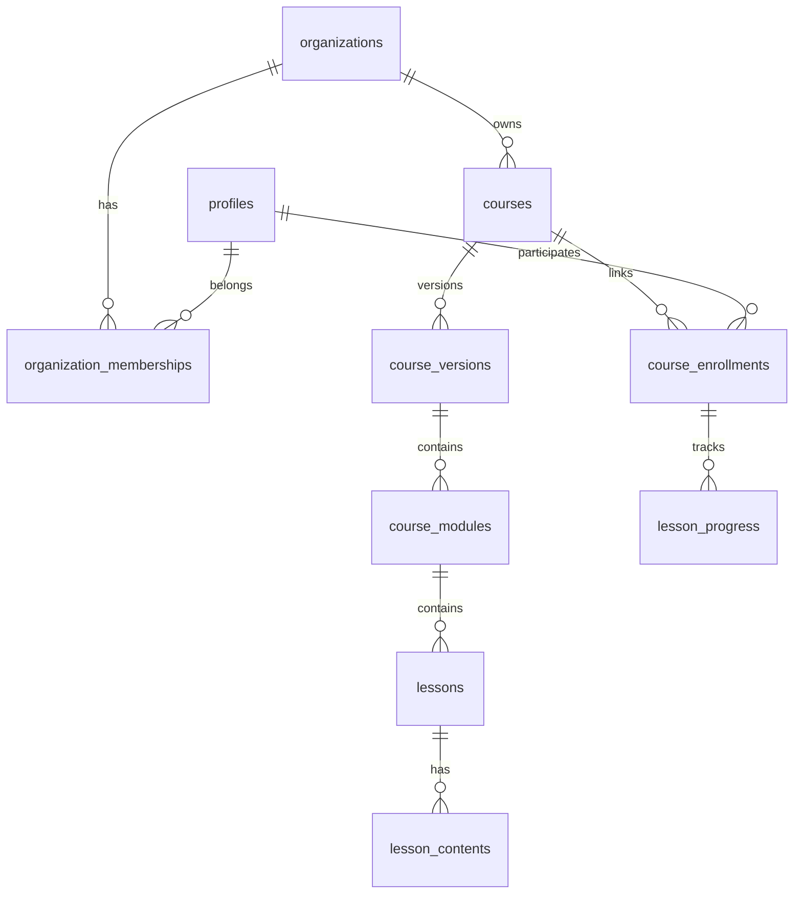

# Modelo de Dados

Ver migrations em `supabase/migrations/`.

## Diagrama simplificado

## Versionamento de cursos

- `courses`: identidade estável (slug, tenant)
- `course_versions`: conteúdo publicável versionado
- Edição de publicado → nova versão (fase 3)
- Vínculos apontam para versão iniciada

## Terminologia

| Interno (banco) | Interface |
|-----------------|-----------|
| `course_enrollments` | vínculo com o curso |
| enrollment_origin | origem da atribuição |

**Nunca** usar "matrícula" na interface.
